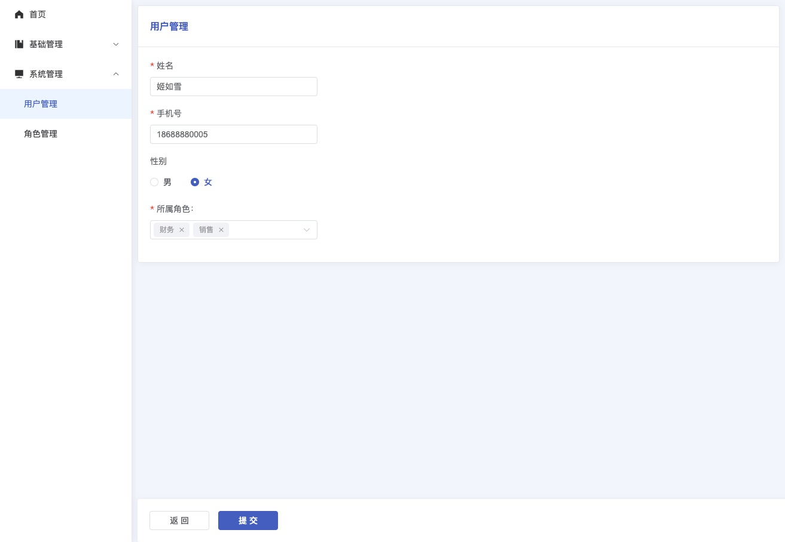

## 表单容器

表单容器一般用于数据的“添加”或者“编辑”页面，统一整体布局，中间表单内容由你决定。 具体功能请查看[源码](https://github.com/wjw-gavin/vue3-vite-ts-element-plus/blob/vue_nest/src/components/FormWrap/index.vue)。

并在底部悬浮操作按钮“取消”和“提交”，与侧边栏折叠动画同步，同时“提交”按钮支持**防连点** `prop` 或通过回调 `loading` 方法处理。示例如下：

```ts{[4,9]}
const onConfirm = (loading: ILoading) => {
  ruleForm.value?.validate(async (valid) => {
    if (valid) {
      loading(true) // 提交按钮会显示 loading 状态

      await createRole(formData)
      ElMessage.success('添加成功')

      loading(false)
      router.back()
    } else {
      return false
    }
  })
}
```

## 效果图


