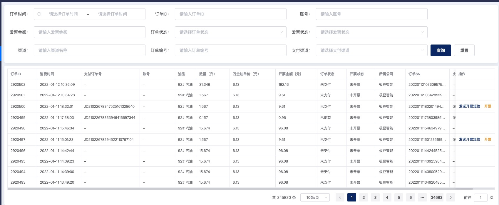

## 列表上方搜索项

目前是由后端来配置，当然也可以前端进行编码配置，主要是通过数据类型 `TSearchItemType` 来指定渲染对应的搜索项。

## 搜索项数据类型

```ts
import type { DatePickType } from 'element-plus'

type TSearchItemType =
  | 'text'
  | 'date'
  | 'select'
  | 'complex'
  | 'date_time'
  | 'date_range'
  | 'time_range'
  | 'multi_select'
  | 'auto_complete'

interface IOptionProp {
  key: string
  value: string
}

interface ISearchItem {
  /** 绑定搜索项值的 id */
  id: string

  /** 搜索项名称 */
  name: string

  /** 搜索项类型 */
  type: TSearchItemType

  /** 搜索项占位字符 */
  hint: string

  /** select 搜索项下拉数据 */
  options?: IOptionProp[]

  /** 级联子数据 */
  children?: ISearchItem[]

  /** 是否多选 */
  multi_select?: boolean
}
```

## 部分效果图


