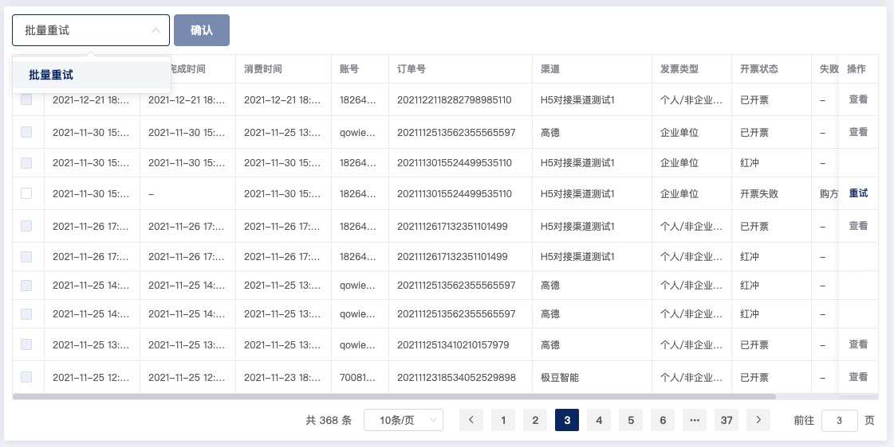

## 列表封装

`table` 应该是项目的**核心组件** ，里面包含了搜索、列表、分页、跳转、单行数据操作等。结合 `useTable`，使用方便。组件在扩展一些功能的同时，保留了 element 组件原有的属性方法。具体功能请查看[源码](https://github.com/wjw-gavin/vue3-vite-ts-element-plus/blob/vue_nest/src/components/table/index.vue)。

## 列表配置数据类型

```ts
import type { DatePickType, LinkProps, RenderRowData } from 'element-plus'
import type { ComponentPublicInstance } from 'vue'

// 表头
interface ITableHead {
  /** 表头名称 */
  label: string

  /** 对应列的字段名 */
  prop: string

  /** 列宽 */
  width?: number

  /** 是否排序 */
  sortable?: boolean

  /** 插槽 name */
  slot?: string
}

// 操作按钮
interface IButtons {
  /** 按钮文字 */
  text: string

  /** 按钮类型 */
  type?: LinkProps['type']

  /** 是否显示， 默认 false */
  show: boolean

  /** 点击回调 */
  click?(scope: RenderRowData<any>): void
}

// 操作列
interface ITableOperation {
  /** 操作栏列宽 */
  width?: number

  /** 是否悬浮，默认 right */
  fixed?: string

  /** 操作栏按钮 */
  buttons?: Array<IButtons | ((scope: RenderRowData<any>) => IButtons)>
}

// 列表配置
interface ITableConfig {
  /** 列表请求地址 */
  api: string

  /** 是否显示索引 */
  index?: boolean

  /** 列表请求参数 */
  params?: TObject

  /** 列表表头 */
  headers: ITableHead[]

  /** 是否显示复选框 */
  selection?: boolean

  /** 列表搜索项 */
  searchItems?: ISearchItem[]

  /** 列表操作栏按钮 */
  operations?: ITableOperation
}

// 暴露的实例类型及方法
export type TableExpose = {
  dispatchLoad: () => void
}

export type TableInstance = ComponentPublicInstance<TableExpose>
```

## 部分功能效果图

<!--  -->


